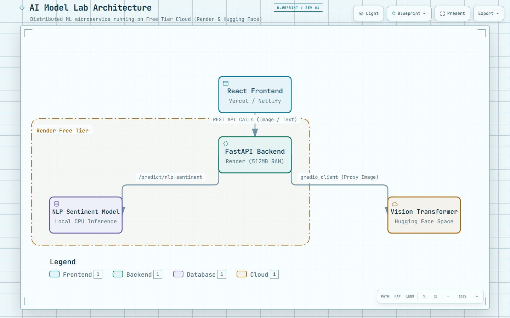

# Multi-Model AI Showcase Lab

A production-style ML web application that showcases multiple AI models (Text and Vision) through a unified frontend and backend architecture. It features a scalable model registry that dynamically loads available models.

> **Live Demo:** *(deploy and add URL here)*  
> **API Docs:** *(backend URL)/docs*  

---

## Overview

The application has been upgraded from a single NLP classifier into a Multi-Model AI Showcase Lab. It currently hosts two deep learning models:

1. **NLP Text Classifier:** A binary sentiment model (Positive/Negative) trained on the IMDb dataset using a TensorFlow Hub text embedding.
2. **Vision Transformer (ViT):** An image classification model (10 classes) trained on CIFAR-10.

| Layer | Technology |
|---|---|
| ML Models | TensorFlow 2 + TF Hub / Keras 3 |
| Backend API | FastAPI + Uvicorn + Pydantic |
| Frontend | Next.js 14 + React + TypeScript + Tailwind CSS |
| Container | Docker |
| Pattern | Adapter / Registry Pattern |

---

## Architecture

[](architecture.html)
*(Click the image to explore the interactive architecture diagram)*

The backend utilizes an **Adapter/Registry Pattern** to dynamically route inference requests to the appropriate loaded model. If a model weight file is missing on disk, the backend gracefully marks it as `unavailable` without crashing.

```
USER INPUT (Browser)
        ↓
    Next.js 14 (ModelLab.tsx)
    [Text Input] or [Image Upload]
        ↓  HTTP POST /predict/{model_id}
   FastAPI API
        ↓
   ModelRegistry
        ↓
  BaseModelAdapter (Interface)
   ↙           ↘
NLPAdapter   ViTAdapter
   ↓             ↓
TF SavedModel  TF .keras File
```

---

## The Models

### 1. NLP Sentiment Classifier (Text)
- **Task:** Binary Sentiment Classification
- **Dataset:** IMDb Movie Reviews
- **Embedding:** `gnews-swivel-20dim`
- **Architecture:** Swivel (20-dim) → Dense(16, ReLU) → Dense(1, Logit)
- **Parameters:** ~400,000

### 2. Vision Transformer (Image)
- **Task:** 10-Class Image Classification
- **Dataset:** CIFAR-10
- **Input:** 32x32 RGB Image
- **Architecture:** PatchExtractor (6x6) → 8 Transformer Blocks (4 Heads) → MLP Head
- **Parameters:** ~1.2M

---

## Features

- 🎯 Real-time inference via REST API for both Text and Image data
- 🧩 **Scalable Registry:** Easily add new models by creating a new `Adapter` class
- ⚡ Measured inference latency returned on every request
- 🧠 Models loaded once at startup into memory
- 📸 Drag-and-drop Image Upload UI for the Vision Transformer
- 📖 Auto-generated API docs (`/docs`, `/redoc`)
- 🌗 Dark / light mode UI with modern glassmorphism

---

## API Endpoints

| Method | Path | Description |
|--------|------|-------------|
| `GET` | `/` | API metadata |
| `GET` | `/health` | Health check |
| `GET` | `/models` | List all models in the registry and their status |
| `GET` | `/models/{id}` | Get metadata for a specific model |
| `POST` | `/predict/nlp-sentiment` | Run text inference (JSON) |
| `POST` | `/predict/vision-transformer` | Run image inference (Multipart Form) |

---

## Local Development

### Prerequisites
- Python 3.10+
- Node.js 18+

### 1. Backend

```bash
cd backend

python -m venv .venv
# Windows: .venv\Scripts\activate
# macOS/Linux: source .venv/bin/activate

pip install -r requirements.txt

# Copy and edit environment file
cp .env.example .env

# Run server
uvicorn app.main:app --reload
```
Open: http://localhost:8000/docs

### 2. Frontend

```bash
cd frontend

cp .env.example .env.local
# Ensure .env.local has: NEXT_PUBLIC_API_URL=http://localhost:8000

npm install
npm run dev
```
Open: http://localhost:3000

### 3. Adding the ViT Model
By default, the ViT model tab will show as **Unavailable** if `models/vit_model.keras` is not found. To activate it:
1. Export the CIFAR-10 ViT `.keras` file from your Jupyter Notebook.
2. Place it in `backend/models/vit_model.keras`.
3. Restart the backend server.

---

## Deployment

### 1. Render (FastAPI Backend)
Because Render's Free Tier limits RAM to 512MB, loading the 260MB Vision Transformer will cause an Out-Of-Memory (OOM) crash. The backend is configured to support two modes to bypass this:

**Option A (Skip ViT):** 
Set `ENABLE_VIT=false` in your Render Environment Variables. The NLP model will work perfectly, and the ViT model will be safely ignored.

**Option B (Hugging Face Microservice):**
Host the massive ViT model on a free Hugging Face Space (which provides 16GB RAM) and let Render proxy the requests!
1. Create a new **Gradio** Space on [Hugging Face](https://huggingface.co/spaces) (this is the free tier).
2. Upload the 2 files located in the `hf_space/` directory of this repository (`app.py`, `requirements.txt`). *(You don't need the Dockerfile).*
3. Upload your `vit_model.keras` into the same Hugging Face Space.
4. Once your Space is "Running", note its Space ID (e.g., `username/space-name`).
5. In your Render Dashboard, add the Environment Variable `HF_SPACE_URL` and paste the exact Space ID (e.g., `deveshcodes/vit-cifar10`). Do NOT paste the full URL.
6. Make sure `ENABLE_VIT=true`. 

Render will now seamlessly forward all image classifications to Hugging Face!

### 2. Vercel (Next.js Frontend)
1. Import your GitHub repository to Vercel.
2. Set the `NEXT_PUBLIC_API_URL` environment variable to your Render deployment URL.
3. Deploy!

---

## Docker

### Build and run the backend

```bash
# From the project root:
docker build -t multi-model-api ./backend

docker run \
  -p 8000:8000 \
  -e FRONTEND_URL=http://localhost:3000 \
  multi-model-api
```

> **Note:** Ensure your model artifacts exist in `backend/models/` before building the Docker image.

---

## Future Improvements

- Add request rate limiting
- Add model versioning in the registry
- Add a generative text model (e.g., Llama/Mistral via HuggingFace or vLLM)
- Build a persistent database to track prediction history and user feedback
